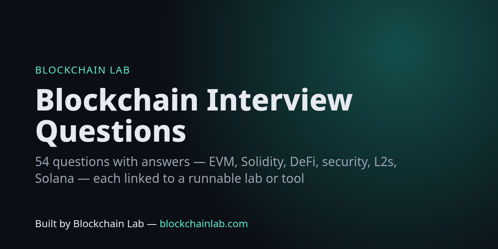

# Blockchain Developer Interview Questions

**54 blockchain and smart-contract interview questions with concise answers.** Each answer links to a runnable lab, a free tool or a Blockchain Lab explainer so you can go deeper. The questions cover fundamentals, EVM and gas, Solidity, token standards, DeFi, security, scaling, Solana/Bitcoin and system design.

> Built by **Blockchain Lab — [blockchainlab.com](https://blockchainlab.com/?utm_source=github&utm_medium=readme&utm_campaign=blockchain-interview-questions)**

[Fundamentals](#fundamentals) · [EVM & gas](#evm--gas) · [Solidity](#solidity) · [Tokens & standards](#tokens--standards) · [DeFi](#defi) · [Security](#security) · [Scaling & interoperability](#scaling--interoperability) · [Solana & other chains](#solana--other-chains) · [System design](#system-design)

Tip: click a question to reveal the answer. Practise answering out loud first, then check yourself against the linked [lab](https://github.com/Blockchains/blockchainlab-labs) by running its tests.

## Fundamentals

<b>1. What does a cryptographic hash function give a blockchain?</b>

Determinism, preimage resistance and collision resistance. Blocks commit to their parent's hash, so changing history means redoing every later commitment. Transactions are committed via a Merkle root.

→ Go deeper: https://blockchainlab.com/learn/concepts/hash?utm_source=github&utm_medium=readme&utm_campaign=blockchain-interview-questions

<b>2. What is a Merkle tree and why do light clients care?</b>

A binary tree of hashes whose root commits to every leaf. An inclusion proof needs only about log2(n) sibling hashes, so a light client can check a transaction is in a block without downloading the block.

→ Go deeper: https://blockchainlab.com/learn/concepts/merkle-tree?utm_source=github&utm_medium=readme&utm_campaign=blockchain-interview-questions

<b>3. Probabilistic vs deterministic finality?</b>

Under Nakamoto-style PoW, reorg probability falls with each confirmation but never reaches zero. BFT-style protocols (Tendermint, Ethereum's Casper FFG checkpoints) finalise once a supermajority votes, and reverting that requires provable slashing or a large share of stake.

→ Go deeper: https://blockchainlab.com/learn/concepts/finality?utm_source=github&utm_medium=readme&utm_campaign=blockchain-interview-questions

<b>4. PoW vs PoS security assumptions?</b>

PoW: an attacker needs a majority of hash power, an ongoing external cost. PoS: an attacker needs a large share of stake, which can be slashed, so the cost lands inside the protocol. PoS also has to deal with long-range attacks (weak subjectivity checkpoints).

→ Go deeper: https://blockchainlab.com/learn/compare/proof-of-stake-vs-proof-of-work?utm_source=github&utm_medium=readme&utm_campaign=blockchain-interview-questions

<b>5. UTXO vs account model?</b>

UTXO (Bitcoin): state is a set of unspent outputs. It parallelises easily and privacy is better, but stateful contracts are harder. Accounts (Ethereum): global balances and storage. Contracts are easy, but nonces are needed for replay protection and transactions touching shared state conflict more.

→ Go deeper: https://blockchainlab.com/learn/protocols/bitcoin?utm_source=github&utm_medium=readme&utm_campaign=blockchain-interview-questions

<b>6. What is a nonce in Ethereum transactions?</b>

A per-account counter. Each transaction must use the next nonce, which orders an account's transactions and stops replay. A stuck low-nonce tx blocks everything after it, so you replace it by sending the same nonce with a higher fee.

→ Go deeper: https://blockchains.github.io/blockchainlab-tools/address/

<b>7. What is the data availability problem?</b>

Validators must be sure block data was published, not just the header. If it was withheld, nobody can rebuild state or prove fraud. Rollups post data to L1 (calldata or EIP-4844 blobs) or to a DA layer, and DA sampling lets light nodes check it probabilistically.

→ Go deeper: https://blockchainlab.com/learn/concepts/data-availability?utm_source=github&utm_medium=readme&utm_campaign=blockchain-interview-questions

<b>8. What does an oracle add and what risk does it bring?</b>

A way to bring off-chain facts on-chain. The chain can verify the oracle's signatures but not the real world, so the oracle's committee or data source becomes a trust assumption and a manipulation target (e.g. spot-price oracles and flash loans).

→ Go deeper: https://blockchainlab.com/learn/concepts/oracle?utm_source=github&utm_medium=readme&utm_campaign=blockchain-interview-questions

## EVM & gas

<b>9. Explain EIP-1559 fees.</b>

Each block has a protocol base fee that adjusts by up to 12.5% per block towards a 50% gas target, and it is burned. Users add a priority fee (tip) for the proposer. maxFeePerGas caps the total, and unused headroom is refunded.

→ Go deeper: https://eips.ethereum.org/EIPS/eip-1559

<b>10. Storage vs memory vs calldata vs transient storage?</b>

Storage persists and is expensive (SSTORE/SLOAD, cold vs warm under EIP-2929). Memory is per-call and grows quadratically in cost. Calldata is the read-only tx input and cheapest for external params. Transient storage (EIP-1153, TSTORE/TLOAD) lasts one transaction, which makes it useful for reentrancy locks.

→ Go deeper: https://github.com/Blockchains/blockchainlab-labs/blob/main/src/L26_GasOptimisation.sol

<b>11. How are storage slots assigned?</b>

State variables fill slots from 0 in declaration order. Values under 32 bytes are packed together. A mapping value lives at keccak256(abi.encode(key, slot)). A dynamic array's length is at its slot and element i at keccak256(slot)+i. Short strings (<32 bytes) are stored inline with length*2 in the lowest byte.

→ Go deeper: https://blockchains.github.io/blockchainlab-tools/storage/

<b>12. What is a function selector?</b>

The first 4 bytes of keccak256 of the canonical signature, e.g. transfer(address,uint256) → 0xa9059cbb. Calldata is the selector followed by ABI-encoded arguments.

→ Go deeper: https://blockchains.github.io/blockchainlab-tools/abi/

<b>13. call vs delegatecall vs staticcall?</b>

call runs the callee's code in the callee's context. delegatecall runs the callee's code in the caller's storage and msg context, which is the basis of proxies and libraries. staticcall forbids state changes.

→ Go deeper: https://github.com/Blockchains/blockchainlab-labs/blob/main/src/L23_UpgradeableProxy.sol

<b>14. Why can't you rely on tx.origin for auth?</b>

tx.origin is the EOA that started the transaction. A malicious contract the user interacts with can then call your contract and pass a tx.origin check. Use msg.sender.

→ Go deeper: https://blockchainlab.com/development-lab/smart-contract-security-assurance?utm_source=github&utm_medium=readme&utm_campaign=blockchain-interview-questions

<b>15. What is CREATE2 used for?</b>

Deterministic addresses: keccak256(0xff ++ deployer ++ salt ++ keccak256(initcode))[12:]. Used for counterfactual wallets, factories and cross-chain same-address deploys.

→ Go deeper: https://github.com/Blockchains/blockchainlab-labs/blob/main/src/L30_Create2Factory.sol

<b>16. What did EIP-4844 change?</b>

It added blob-carrying transactions: cheap, temporary (~18 days) data attached to blocks with a separate blob fee market. This cut rollup data costs sharply. Contracts can't read blob contents, only their versioned hashes.

→ Go deeper: https://eips.ethereum.org/EIPS/eip-4844

<b>17. What does EIP-7702 do?</b>

It lets an EOA set its code to a delegation designator (0xef0100 ++ address), so the EOA runs that contract's code: batching, sponsorship, session keys. The private key still controls the account.

→ Go deeper: https://eips.ethereum.org/EIPS/eip-7702

## Solidity

<b>18. What changed with Solidity 0.8 arithmetic?</b>

Overflow and underflow revert by default (Panic 0x11). unchecked {} opts out for gas when you have proven it is safe, e.g. loop counters.

→ Go deeper: https://github.com/Blockchains/blockchainlab-labs/blob/main/src/L10_Arithmetic.sol

<b>19. Custom errors vs require strings?</b>

Custom errors (error Foo(uint256)) are cheaper to deploy and to revert with, and they carry typed data. Selectors are decoded like functions.

→ Go deeper: https://github.com/Blockchains/blockchainlab-labs/blob/main/src/L02_Counter.sol

<b>20. immutable vs constant?</b>

constant must be known at compile time and is inlined. immutable is set once in the constructor and stored in the runtime bytecode. Neither uses a storage slot.

<b>21. How does receive() differ from fallback()?</b>

receive() runs on plain ETH transfers with empty calldata. fallback() runs when no function matches, or on ETH with data if there is no receive. Either must be payable to accept ETH.

→ Go deeper: https://github.com/Blockchains/blockchainlab-labs/blob/main/src/L08_EtherVault.sol

<b>22. What are events for and what are their limits?</b>

Logs are cheap, indexed (up to 3 indexed topics plus the signature topic for non-anonymous events) and consumed off-chain by indexers and UIs. Contracts can't read them.

→ Go deeper: https://blockchains.github.io/blockchainlab-tools/tx/

<b>23. abi.encode vs abi.encodePacked?</b>

encode pads every value to 32 bytes and is unambiguous. encodePacked is tight. Hashing packed dynamic types next to each other can collide ("ab","c" vs "a","bc"), so use abi.encode for hashes of several dynamic values.

## Tokens & standards

<b>24. Why is the ERC-20 approve race a problem and what helps?</b>

Changing an allowance from N to M lets a spender front-run and spend N then M. Mitigations: set to 0 first, increase/decrease helpers, or use permit (EIP-2612) with exact amounts.

→ Go deeper: https://github.com/Blockchains/blockchainlab-labs/blob/main/src/L04_ERC20Scratch.sol

<b>25. How does EIP-2612 permit work?</b>

The owner signs an EIP-712 typed message (owner, spender, value, nonce, deadline). Anyone can submit it and permit() sets the allowance. The nonce stops replay and the domain separator binds chain and contract.

→ Go deeper: https://github.com/Blockchains/blockchainlab-labs/blob/main/src/L12_Permit.sol

<b>26. ERC-721 vs ERC-1155?</b>

721: one contract, unique token IDs, one owner each. 1155: many IDs per contract, each with balances (fungible or not), batch transfers, and receiver hooks for both single and batch transfers.

→ Go deeper: https://github.com/Blockchains/blockchainlab-labs/blob/main/src/L07_MultiToken.sol

<b>27. What is ERC-4626?</b>

A tokenised vault standard: deposit/mint/withdraw/redeem plus preview functions and share/asset conversion. Watch rounding direction and the first-depositor inflation attack (virtual shares/offset mitigate it).

→ Go deeper: https://eips.ethereum.org/EIPS/eip-4626

<b>28. What is ERC-4337?</b>

Account abstraction without consensus changes. Users send UserOperations to an alt mempool, bundlers package them into EntryPoint calls, and smart accounts validate them, with optional paymasters for gas sponsorship.

→ Go deeper: https://eips.ethereum.org/EIPS/eip-4337

<b>29. How do you safely interact with arbitrary ERC-20s?</b>

Use SafeERC20: some tokens return no bool (e.g. USDT). Account for fee-on-transfer and rebasing tokens by measuring balance deltas, and don't assume 18 decimals.

→ Go deeper: https://github.com/Blockchains/blockchainlab-labs/blob/main/src/L19_Crowdfund.sol

## DeFi

<b>30. Explain a constant-product AMM.</b>

Reserves x·y=k. A swap of dx returns dy = y·dx'/(x+dx'), where dx' is dx after the fee. Price impact grows with trade size relative to reserves. LPs earn fees but are exposed to divergence (impermanent) loss.

→ Go deeper: https://github.com/Blockchains/blockchainlab-labs/blob/main/src/L21_ConstantProductAMM.sol

<b>31. What is a flash loan and why is it dangerous for protocols?</b>

An uncollateralised loan that must be repaid within the same transaction. It is harmless on its own, but it gives anyone huge temporary capital to manipulate spot-price oracles or governance snapshots.

→ Go deeper: https://github.com/Blockchains/blockchainlab-labs/blob/main/src/L22_FlashLoan.sol

<b>32. How would you design a manipulation-resistant price feed?</b>

Avoid single-block spot prices. Use TWAPs over enough blocks, decentralised oracle networks with heartbeats and deviation thresholds, sanity bounds and staleness checks, and circuit breakers.

→ Go deeper: https://blockchainlab.com/learn/concepts/oracle?utm_source=github&utm_medium=readme&utm_campaign=blockchain-interview-questions

<b>33. How does a reward-per-token staking contract stay O(1)?</b>

Keep a global accumulator rewardPerTokenStored, updated lazily, plus per-user checkpoints. earned = balance × (current − userPaid) + stored rewards.

→ Go deeper: https://github.com/Blockchains/blockchainlab-labs/blob/main/src/L20_StakingRewards.sol

<b>34. What is MEV? Give two examples.</b>

Value extractable by ordering, inserting or censoring transactions. Examples: sandwiching AMM swaps, liquidation races, arbitrage. Mitigations include slippage limits, private orderflow and batch auctions.

→ Go deeper: https://docs.flashbots.net/

<b>35. Liquid staking vs restaking risks?</b>

Liquid staking adds the issuer's smart-contract, operator and depeg risk on top of protocol slashing. Restaking reuses stake to secure extra services, so it adds more slashing conditions and correlated risk.

→ Go deeper: https://blockchainlab.com/intelligence/staking/native-vs-liquid-vs-restaking?utm_source=github&utm_medium=readme&utm_campaign=blockchain-interview-questions

## Security

<b>36. Walk through a reentrancy attack and three defences.</b>

The external call happens before state updates, so the callee re-enters and withdraws again. Defences: checks-effects-interactions, a reentrancy guard (or a transient-storage lock), and pull payments. Also watch cross-function and read-only reentrancy.

→ Go deeper: https://github.com/Blockchains/blockchainlab-labs/blob/main/src/L09_Reentrancy.sol

<b>37. How do you prevent signature replay?</b>

Include a nonce, chainId and the verifying contract (EIP-712 domain), plus a deadline. Mark nonces used. Use ECDSA libraries that reject malleable s values.

→ Go deeper: https://github.com/Blockchains/blockchainlab-labs/blob/main/src/L13_Signatures.sol

<b>38. What are common proxy upgrade pitfalls?</b>

Storage collisions between versions (append only, or use ERC-7201 namespaces), uninitialised implementations (call _disableInitializers), function selector clashes, missing upgrade authorisation and constructor logic that never runs behind a proxy.

→ Go deeper: https://github.com/Blockchains/blockchainlab-labs/blob/main/src/L23_UpgradeableProxy.sol

<b>39. Why does rounding direction matter?</b>

It should favour the protocol: round down what users receive and up what they pay. Getting it wrong lets attackers loop tiny operations to extract value, a common vault/AMM bug class.

→ Go deeper: https://github.com/Blockchains/blockchainlab-labs/blob/main/src/L10_Arithmetic.sol

<b>40. Fuzzing vs invariant testing vs formal verification?</b>

Fuzzing: random inputs to a single function against a property. Invariant (stateful) testing: random call sequences through handlers while global properties must hold. Formal/symbolic tools (e.g. Halmos, Certora) aim to prove a property for all inputs within bounds.

→ Go deeper: https://github.com/Blockchains/blockchainlab-labs/blob/main/test/L28_InvariantVault.t.sol

<b>41. How does commit-reveal mitigate front-running?</b>

Users first commit hash(sender, value, salt), then reveal after the commit phase closes. Observers can't see choices in time to react. Add deposits to punish non-reveal.

→ Go deeper: https://github.com/Blockchains/blockchainlab-labs/blob/main/src/L16_CommitReveal.sol

<b>42. Name five things you check first in an audit.</b>

Access control on state-changing functions, external calls and reentrancy, oracle and price assumptions, arithmetic and rounding, upgradeability and initialisation. Then token edge cases and DoS (unbounded loops, push payments).

→ Go deeper: https://blockchainlab.com/learn/failure-atlas?utm_source=github&utm_medium=readme&utm_campaign=blockchain-interview-questions

## Scaling & interoperability

<b>43. Optimistic vs ZK rollups?</b>

Optimistic rollups assume state roots are valid and allow fraud proofs during a challenge window (typically about 7 days for withdrawals). ZK rollups post validity proofs, so finality on L1 comes once the proof is verified. Both rely on posted data for safety.

→ Go deeper: https://blockchainlab.com/learn/compare/plasma-vs-rollups?utm_source=github&utm_medium=readme&utm_campaign=blockchain-interview-questions

<b>44. What are the main risks of bridges?</b>

Validator or multisig key compromise, contract bugs, finality mismatches between chains and message replay. Many of the largest losses have been bridge exploits.

→ Go deeper: https://blockchainlab.com/learn/concepts/bridge?utm_source=github&utm_medium=readme&utm_campaign=blockchain-interview-questions

<b>45. Why do L2 transactions have two fee components?</b>

L2 execution gas plus an L1 data fee for posting the transaction's data to Ethereum (blobs since EIP-4844). Receipts on OP-stack chains expose l1Fee.

→ Go deeper: https://blockchains.github.io/blockchainlab-tools/tx/

<b>46. Cosmos vs Polkadot interoperability?</b>

Cosmos: sovereign chains with their own validators, connected by IBC light clients. Polkadot: parachains share the relay chain's security and communicate via XCM.

→ Go deeper: https://blockchainlab.com/learn/compare/cosmos-vs-polkadot?utm_source=github&utm_medium=readme&utm_campaign=blockchain-interview-questions

## Solana & other chains

<b>47. How does Solana's account model differ from the EVM?</b>

Programs are stateless. State lives in separate accounts that are passed into each instruction, and transactions declare read/write accounts up front, so the runtime (Sealevel) can run non-conflicting transactions in parallel.

→ Go deeper: https://solana.com/docs

<b>48. What is a PDA on Solana?</b>

A Program Derived Address: derived from seeds plus a program ID and deliberately off the ed25519 curve, so no private key exists. The program can sign for it via invoke_signed.

→ Go deeper: https://solana.com/docs

<b>49. How are Solana fees structured?</b>

A base fee of 5,000 lamports per signature plus an optional priority fee priced in micro-lamports per compute unit.

→ Go deeper: https://blockchains.github.io/blockchainlab-tools/gas/

<b>50. What is Taproot (BIP-341)?</b>

SegWit v1 outputs using Schnorr signatures (BIP-340) and MAST script trees. Key-path spends look like single-sig, which improves privacy and efficiency for multisig and complex scripts.

→ Go deeper: https://blockchains.github.io/blockchainlab-tools/reference/?q=341

## System design

<b>51. Design an allowlist airdrop for 1M addresses.</b>

Store only a Merkle root on-chain. Users claim with (account, amount, proof) and a bitmap or mapping blocks double claims. Build the tree with OpenZeppelin StandardMerkleTree off-chain and publish the tree dump.

→ Go deeper: https://github.com/Blockchains/blockchainlab-labs/blob/main/src/L11_MerkleAirdrop.sol

<b>52. Design a 2-of-3 treasury.</b>

Use an audited smart-account multisig (e.g. Safe) rather than a custom one. Keep keys on separate hardware and with separate people. Add a timelock for large transfers, monitoring and a documented recovery process.

→ Go deeper: https://blockchainlab.com/intelligence/custody/mpc-vs-multisig-vs-hsm?utm_source=github&utm_medium=readme&utm_campaign=blockchain-interview-questions

<b>53. How would you index on-chain events for a dashboard?</b>

Subscribe to logs (or use The Graph or a custom indexer). Handle reorgs by waiting for finality or rolling back. Backfill from deployment block in chunks, make processing idempotent, and store the block number and log index.

→ Go deeper: https://thegraph.com/docs/

<b>54. How do you give an AI agent safe on-chain capabilities?</b>

Give it a dedicated wallet with spend limits and allowlisted contracts (e.g. a smart account with session keys), plus human approval above thresholds, full logging and a kill switch. Read-only tools need no keys at all (see blockchainlab-mcp).

→ Go deeper: https://blockchainlab.com/learn/concepts/agent-wallet?utm_source=github&utm_medium=readme&utm_campaign=blockchain-interview-questions

## More

- [Blockchain developer roadmap](https://github.com/Blockchains/blockchain-dev-roadmap) · [30 hands-on labs](https://github.com/Blockchains/blockchainlab-labs) · [Blockchain Lab Tools](https://blockchains.github.io/blockchainlab-tools/)
- [Glossary](https://blockchainlab.com/learn/glossary?utm_source=github&utm_medium=readme&utm_campaign=blockchain-interview-questions) · [Whitepaper library](https://blockchainlab.com/whitepaper?utm_source=github&utm_medium=readme&utm_campaign=blockchain-interview-questions) · [Failure atlas](https://blockchainlab.com/learn/failure-atlas?utm_source=github&utm_medium=readme&utm_campaign=blockchain-interview-questions)

Contributions welcome: add a question with an accurate, sourced answer and a link to go deeper. Text CC BY 4.0. Attribute Blockchain Lab.

## Licence

Text CC BY 4.0 (attribute Blockchain Lab), code MIT. See [LICENSE](LICENSE).

## Contributing

Issues and pull requests are welcome. Please read the [contributing guide](https://github.com/Blockchains/.github/blob/main/CONTRIBUTING.md), [code of conduct](https://github.com/Blockchains/.github/blob/main/CODE_OF_CONDUCT.md) and [security policy](https://github.com/Blockchains/.github/blob/main/SECURITY.md) first.

---
Built by Blockchain Lab — [blockchainlab.com](https://blockchainlab.com/?utm_source=github&utm_medium=readme&utm_campaign=blockchain-interview-questions)
